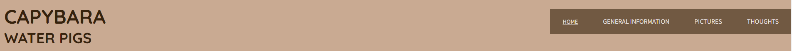
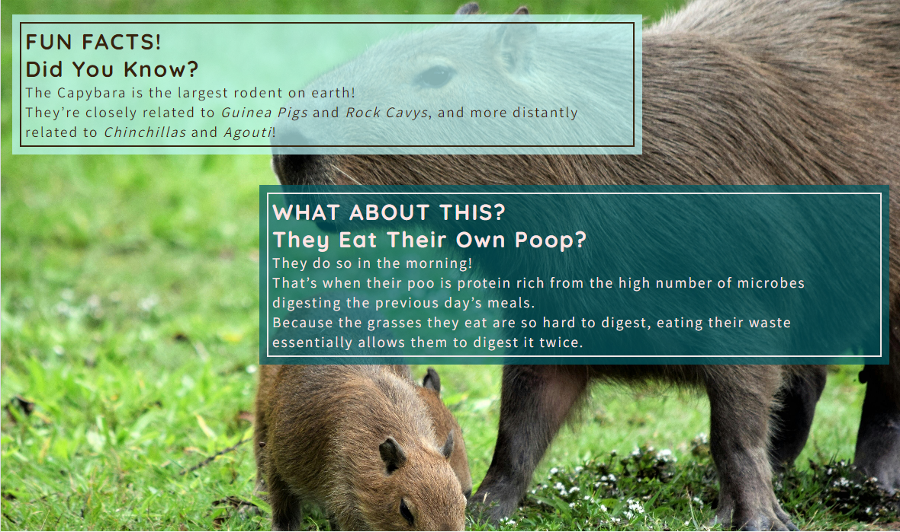
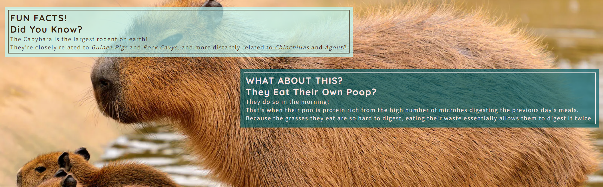
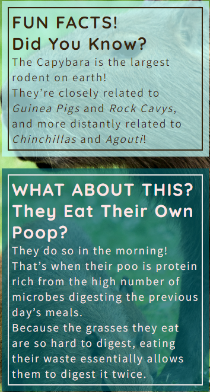
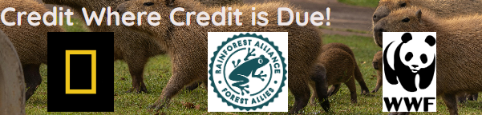
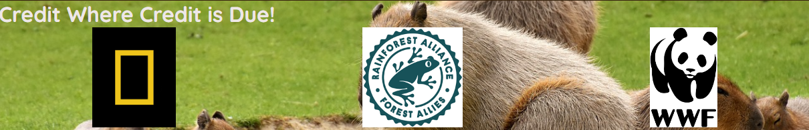

`python3 -m http.server`
ctrl-c - clears the terminal if frozen

# Capybara

Capybara is a website designed to give factual information to users in a fun format, all about Capybaras. This animal has become wildly popular, so for anyone looking to learn some fun tidbits this site will be a good place to come. There will also be a page where people can share their thoughts about the website or capybara's in general.

## Features 

### Existing Features

- __Navigation Bar__

  - Featured on all three pages, the full responsive navigation bar includes links to the Logo, Home page, General Information page, Pictures page and the Thoughts page and is identical in each page to allow for easy navigation.
  - This section will allow the user to easily navigate from page to page across all devices without having to revert back to the previous page via the ‘back’ button. 

- __The landing Page Image (smaller screens)__

  - The landing includes a photograph with text overlay to allow the user to see some fun facts as soon as they arrive. 
  - This section introduces the user to Capybara with an eye catching image and inviting color scheme to grab their attention.

- __The landing Page Image (larger screens)__

  - This section has a different image based on screen size, to ensure an optimal view for the user of each image.

- __Fun Facts Sections__

  - The fun facts section will allow the user to see a few fun facts about capybaras, as well as a few links to see which animals they are most closely related to. 
  - This user will see the value of the information provided in a fun way. This should encourage the user to consider exploring the rest of the site. 

- __The Footer__ 

  - The footer section includes links to every website used when collecting reliable information for this site. These will open the pages in new tabs to allow easy navigation for the user. 
  - The footer is valuable to the user as it allows them to easily verify the information on the page to be factually correct.
  - On larger screens the footer is always showing so users can find the sources quickly, without it being in the way on smaller screen sizes.

  - This section also has a different image based on screen size, to ensure an optimal view for the user of each image.

- __General Information Page__

  - This page will detail the scientific facts we know about Capybaras. It will feature seperate sections including general information, anatomy, habitat and diet information.
  - The user will find this useful as a source of information about Capybaras. 

- __Pictures Page__

  - The pictures page will provide the user with images of Capybaras in various settings. 
  - This section is valuable to the user as they will have the option to look at Capybaras in their natural habitats. 
  - This page will also feature a youtube video on the bottom of the page with a fun meme/song about Capybaras.

- __Your Thoughts Page__

  - This page will allow the user to leave feedback on the website and share their thoughts on Capybaras in general. The user will be asked to submit their chosen nickname and any feedback they choose. There is an optional field for email address for any users who would like a response to their comments. 

### Features Left to Implement

- Another feature idea

## Testing 

- __The Header__

  - I tested the header on mobile screens first. The nav bar initally was displaying over the top of the website title so I used flex properties and position properties to fix it. Nav toggle was added and styling added for mobile phones.
  - When moving to larger screens the nav toggle was no longer needed and styling was needed to make the navigation clear and useful to the user. 
  - Different margins were needed for different screen sizes to make the main content visible below the header. I used the responsive displey feature on google inspect to determine the media queries needed. 
  - I used an opacity for the background of the nav bar and tested this on all screen sizes. I found that the larger screens where the navigation items are all displayed needed less color behind them while still being visible. 

- __Landing Page Images__

  - I went through a lot of different images until I landed on the ones chosen. The images I chose determined the color used for backgrounds using [Color Mind](http://colormind.io/) then [Color Space](https://mycolor.space/?hex=%23C9AAAA&sub=1).
  - I tested the image for smaller screens first making sure it would fill the entire screen. I had issues with this until I revisited some of the course material on the different units of measurement (urika moment). That solved the blank space at the bottom of the screen, and worked for larger screens at the same time.

- __Fun Facts Sections__

  - First I styled these for mobile screens. I tried different settings with the padding, margins and background colors until I was happy with the outcome.
  - When moving the second section to the right for larger screens I struggled for a while with which properties to use so I researched and found the float property, which worked for all larger screen sizes without the need of a further media queries.
  - Tested on my large screen without google inspect running to ensure it looked good as large as I can test, then I used the responsive feature on google inspect and se the percentage to 50 and tested as far as I could with that. 

- __The Footer__

  - First I styled this for mobile phones. As I used the responsive display feature on google inspect I found that it wasn't always at the bottom of the screen when the screen size increased. I thought I could fix it using flex properties, so I practiced flex properties on [Flexbox Froggy](https://flexboxfroggy.com/). I ended up fixing this with the main images height value. 
  - On larger screens I wanted the footer to always show, so I set the position values accordingly and again tested this on google inspect to 50% and as big as it would go on my screen.

- __General Information Page__

  - This was very similar to the main page so I had a lot less problems making this fit for all screen sizes and orientations. 

- __Photos Page__

  - I styled the photos page and added media queries to ensure the best visability on all screen sizes. 
  - I had trouble with the youtube display being full width on larger screens, so I had to change the code a bit for ease of use on all screen sizes. I once again used googles inspect mode to try it on screen sizes bigger than my own, including the landscape feature on different mobile devices available. 

- __Your Thoughts Page__

  - 

### Validator Testing 

- HTML
  - No errors were returned when passing through the official [W3C validator](https://validator.w3.org/nu/?doc=https%3A%2F%2Fcode-institute-org.github.io%2Flove-running-2.0%2Findex.html)
- CSS
  - No errors were found when passing through the official [(Jigsaw) validator](https://jigsaw.w3.org/css-validator/validator?uri=https%3A%2F%2Fvalidator.w3.org%2Fnu%2F%3Fdoc%3Dhttps%253A%252F%252Fcode-institute-org.github.io%252Flove-running-2.0%252Findex.html&profile=css3svg&usermedium=all&warning=1&vextwarning=&lang=en#css)

### Unfixed Bugs

You will need to mention unfixed bugs and why they were not fixed. This section should include shortcomings of the frameworks or technologies used. Although time can be a big variable to consider, paucity of time and difficulty understanding implementation is not a valid reason to leave bugs unfixed. 

## Deployment

- The site was deployed to GitHub pages initially on 15/07/2024. The steps to deploy are as follows: 
  - In the GitHub repository, navigate to the Settings tab 
  - From the source section drop-down menu, select the Master Branch
  - Once the master branch has been selected, the page will be automatically refreshed with a detailed ribbon display to indicate the successful deployment. 

- The live link can be found here - https://sarab333.github.io/capybara-website/ 

- As the website is being built use the git commands 'git add .', 'git commit -m"commit message"' and 'git push' to send the changes to the repository, and after you refresh the live page you can see your changes on the live site.

## Credits 

- Favicon from [Flaticon](https://www.flaticon.com/free-icons/capybara)
> '<a href="https://www.flaticon.com/free-icons/capybara" title="capybara icons">Capybara icons created by Freepik - Flaticon</a>'

- Copied from the Love Running project in style.css
>"/* Asterisk wildcard selector to override default styles added by the browser */"
>"* { padding: 0; margin: 0; box-sizing: border-box; }"

- Idea and implimentation of nav toggle from Love Running project (not copied directly)
>/* Nav toggle */
#nav-toggle:checked~nav { display: block; }
>#nav-toggle { display: none; }
>.nav-toggle-label { font-size: 200%; margin: 10px 10px; }

- Youtube linking copied from [TechStacker](https://techstacker.com/how-to-responsive-youtube-videos/)
>(html)
<iframe width="560" height="315" src="https://www.youtube.com/watch?v=zTgQ_VnrP_s" frameborder="0"
 allow="accelerometer; autoplay; encrypted-media; gyroscope; picture-in-picture" allowfullscreen></iframe>

>(css).youtube-video-container {position: relative; overflow: hidden; width: 100%;} .youtube-video-container::after {
  display: block; content: "Capybara Song"; padding-top: 56.25%;} .youtube-video-container iframe {position: absolute;
  top: 0; left: 0; width: 100%; height: 100%;}

### Content 

- All text information used from these three sites:
>https://www.worldwildlife.org/stories/are-capybaras-rodents-and-5-other-capybara-facts

>https://www.nationalgeographic.com/animals/mammals/facts/cabybara-facts

>https://www.rainforest-alliance.org/species/capybara/

- Instructions on how to implement form validation on the Sign Up page was taken from [Specific YouTube Tutorial](https://www.youtube.com/)

### Media

- Images for Pictures page from:[Pexels](https://www.pexels.com/search/capybara/) with credit to Pixaby, Brett Sayles, Lucas Pezeta, Jonatan 
Bermudez Pascuas, Cassius Cardoso, João Saplak, Magali Guimarães, Rutpratheep Nilpechr, Juan Felipe Ramírez, Messala Ciulla, Renan Rezende, Bernardo 
Brandolin, Tim Gomes, Joel Alencar, Noe De Angelis and [unsplash](https://unsplash.com/s/photos/capybara) with credit to Jaime Dantas, Klaus Steinberg, Didin Hasbullah and [Pixaby](https://pixabay.com/images/search/capybara/) with credit to Alexas Fotos, herbert2512, falco and paola3131pc.

- Image for the main page [Magali Guimarães on Pexels](https://www.pexels.com/photo/capybaras-in-close-up-photography-5919712/)

- Image for the main page (on and over 1240px) [Britannica Website](https://www.britannica.com/animal/capybara-genus)

- Image for the footer [Joel Alencar on Pexels](https://www.pexels.com/photo/a-group-of-capybaras-walking-in-a-field-24032086/)

- Image for footer (on and over 768px) [Alexas_Fotos on Pixabay](https://pixabay.com/photos/water-pigs-capybara-wildlife-mammal-3557854/)

- The images used for the logos in the footer are from [National Geographic](https://www.google.com/url?sa=i&url=https%3A%2F%2Fwww.pinterest.com.au%2Fpin%2F33636328450640096%2F&psig=AOvVaw3axKheHPHhvQy-WBgatVsR&ust=1720644634948000&source=images&cd=vfe&opi=89978449&ved=0CBEQjRxqFwoTCOCf-sj_mocDFQAAAAAdAAAAABAE), [World Wildlife Foundation](https://www.google.com/url?sa=i&url=https%3A%2F%2Fen.wikipedia.org%2Fwiki%2FWorld_Wide_Fund_for_Nature&psig=AOvVaw350eJ6qoyQRRRIy8sC8UW2&ust=1720650180708000&source=images&cd=vfe&opi=89978449&ved=0CBEQjRxqFwoTCIjMjuH_mocDFQAAAAAdAAAAABAE) and [Rainforest Alliance](https://www.google.com/url?sa=i&url=https%3A%2F%2Fwww.rainforest-alliance.org%2Fbusiness%2Fmarketing-sustainability%2Fusing-our-logo-and-seal%2F&psig=AOvVaw2ap1sc9heM3PNhFk0y7JtH&ust=1720645412332000&source=images&cd=vfe&opi=89978449&ved=0CBEQjRxqFwoTCJiogfL_mocDFQAAAAAdAAAAABAE)
